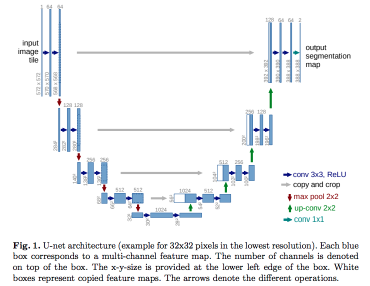

# Neuron Image Detection and Co-localization
## Grinberg Neurosciences Lab at UCSF

repo name: ucsf_gringberg_neuro_images

This project was created to build a tool to identify immunofluorescence-labeled human neurons in tissue microarrays.  

Ground truth data for this project was provided by the Grinberg Lab at UCSF and consisted of 200+ human expertly-labeled images for model training and validation.

[A view of a microscopy image]

## Repo Overview
The project is divided into 3 folders for development work. The last folder 'ucsf_production' will host the final code at completion.

The goal of this project is to perform segmentation analysis on immunoflourescently labeled neurons on tissue microarrays. The project is in collaboration with the Grinberg Lab at UCSF. 

Project Phases
1. NeuN-stained neuron segmentation
2. Colocalization of neurons with other markers
3. Package tool for utilization in NIH's open source ImageJ microscopy software.

## Phase 1 - Segmentation
Python
Fast.ai library
U-Net model architecture
  
[image source](https://arxiv.org/pdf/1505.04597.pdf)

## Phase 2 - Colocalization

## Phase 3 - ImageJ

Three work folders:
1. early_development: computer vision algorithm development using fastai data.
2. ucsf_development : model creation using ucsf training images
3. ucsf_production: implementation of the model into ImageJ, an open-source microscope inspection platform built by the NIH. 

The goal of this project is to perform segmentation analysis on immunoflourescently labeled neurons on tissue microarrays. The project is in collaboration with the Grinberg Lab at UCSF. 

Three work folders:
1. early_development: computer vision algorithm development using fastai data.
2. ucsf_development : model creation using ucsf training images
3. ucsf_production: implementation of the model into ImageJ, an open-source microscope inspection platform built by the NIH. 

Update 08/27/2019:
Project is in early development. Model backbone selection phase. Awaiting ground truth from Grinberg lab.
